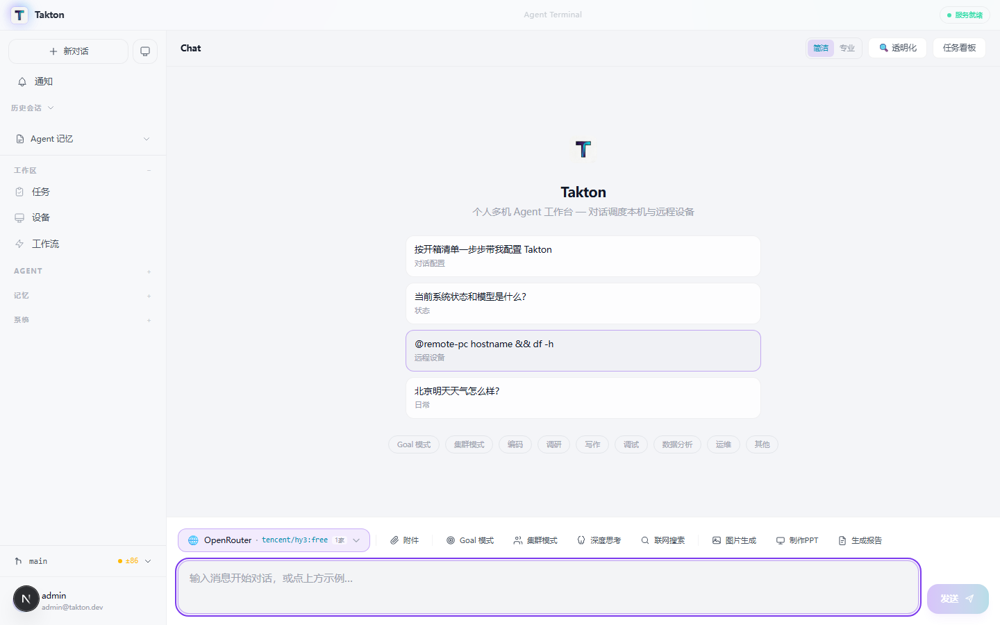
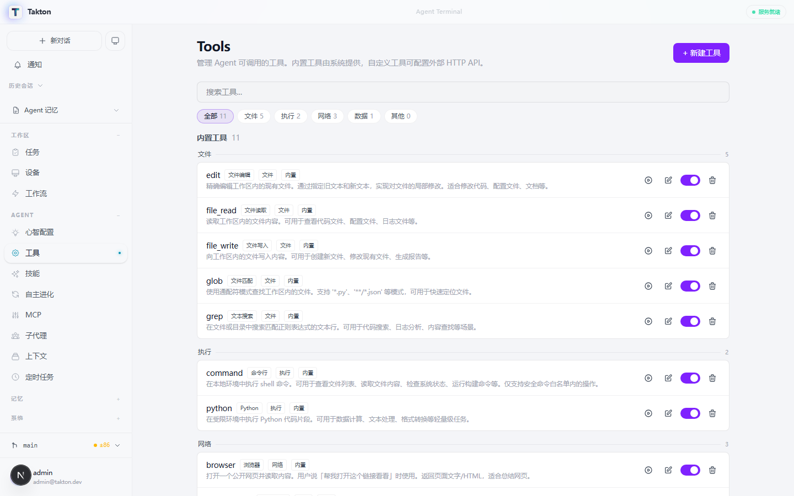
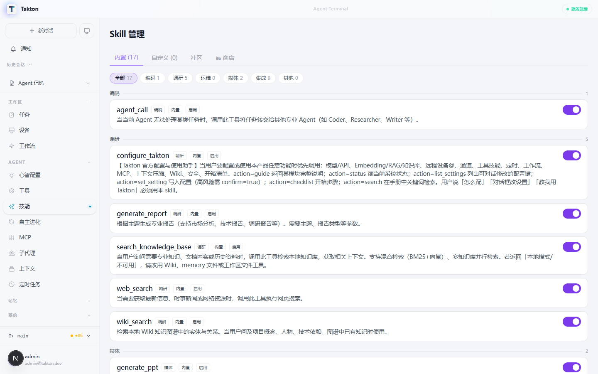
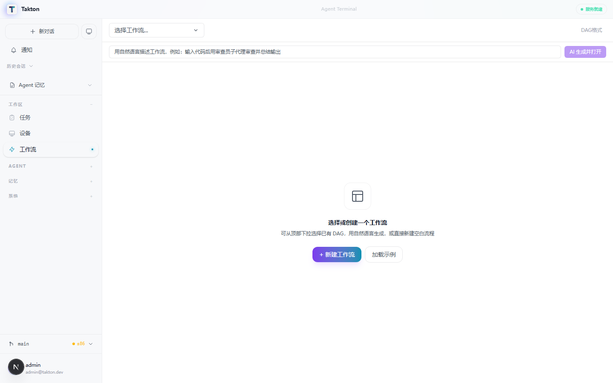
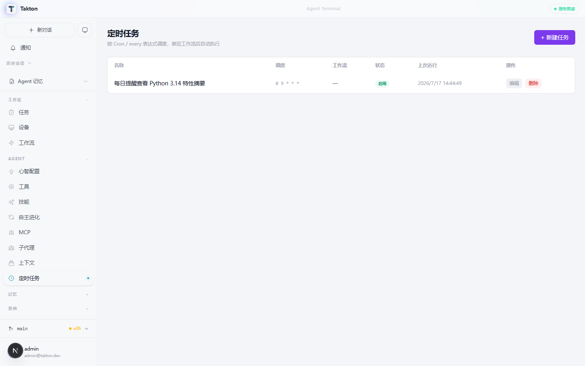
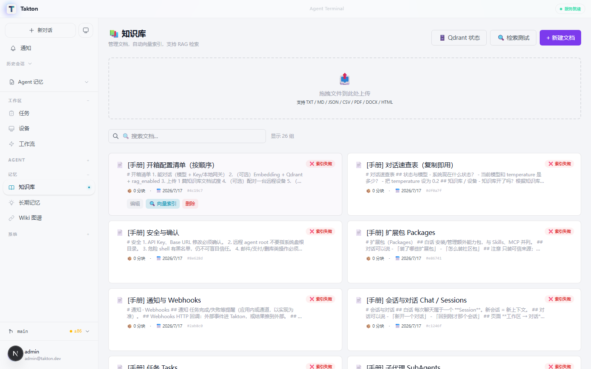
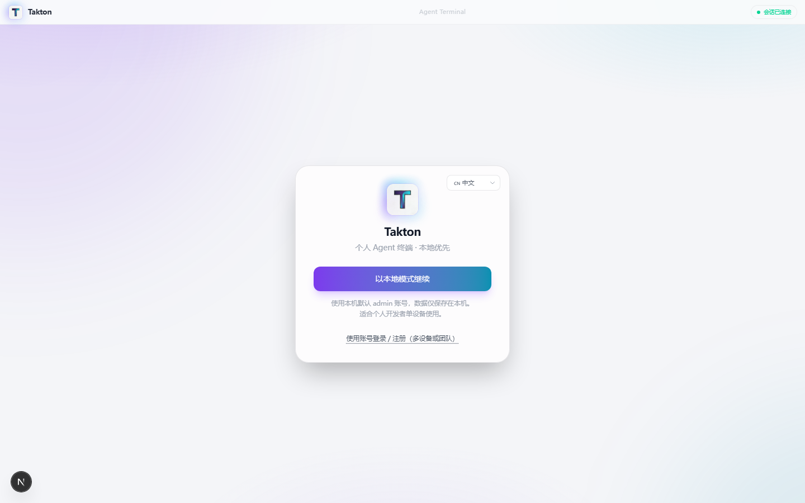
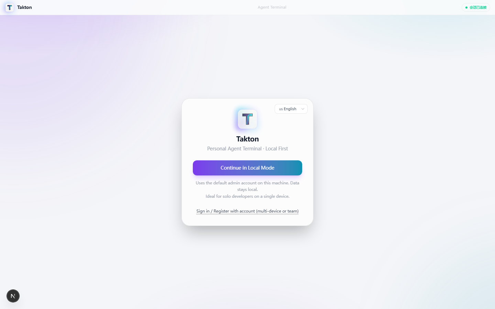

<div align="center">

<br/>


# ⚡ Takton

### Governed, self-evolving digital-employee runtime · 带治理内核的可自进化数字员工运行时

**Local-first · Unified Run · Permission Court · Replay-gated Evolution**

**本地优先 · 统一 Run · 权限一张网 · 回放门禁进化**

<br/>

[](https://github.com/wu1w/takton/tree/feature/agent-kernel)
[](https://github.com/wu1w/takton/releases)
[](LICENSE)
[](https://github.com/wu1w/takton/stargazers)
[](https://nextjs.org/)
[](https://fastapi.tiangolo.com/)

<br/>

[English](#-features) · [中文](#-核心功能) · [技术手册](docs/TECHNICAL_MANUAL.md)

</div>

---

## 🎯 Why Takton? · 为什么选择 Takton？

> **Takton is not another coding CLI or chat wrapper.** It is a **governed, self-evolving digital-employee runtime** that runs on your machine. Every execution is a recoverable **Run**; tools go through a single **permission court** with explainable audit; skills only ship after **replay validation**. Defaults are light: **SQLite, no Redis, no Qdrant required**.
>
> **Takton 不是又一个 coding CLI / 聊天套壳。** 它是**带治理内核的可自进化数字员工运行时**，完全跑在你本机。一切执行都是可恢复的 **Run**；工具经统一 **权限法院** 可解释审计；技能须经 **回放验证** 才能上岗。默认很轻：**SQLite，不强制 Redis / Qdrant**。

| Pillar · 支柱 | What · 是什么 |
|---------------|----------------|
| **Unified Run** | chat / inbox / cron / cluster share one run model + checkpoint recovery |
| **Permission court** | one decision path · layer / rule / verdict on the Kernel page |
| **Replay-gated evolution** | drafts cannot apply when replay fails |
| **Crew / Identity** | hire employees, budgets, memory bus, growth profile |

See also: [Technical Manual · 技术手册](docs/TECHNICAL_MANUAL.md)

<table>
<tr>
<td width="50%">

### 🧠 Smart Agent Orchestration
Simple questions → single agent. Complex tasks → optional parallel draft fan-out (no tool access) with synthesis. Off by default.

### 🔧 Skill Auto-Generation
Agent writes its own tools when it hits a new task type. 17 builtin skills + infinite extensibility.

### 🖥️ OS-Level Operations
File read/write, terminal commands, browser control, SQLite queries — all gated by a three-level permission model.

</td>
<td width="50%">

### 🧠 智能 Agent 编排
简单问题 → 单 Agent。复杂任务 → 可选并行草稿扇出（无工具权限）+ 汇总。默认关闭。

### 🔧 技能自动生成
Agent 遇到新任务类型时自动编写新工具。17 个内置技能 + 无限扩展。

### 🖥️ 操作系统级能力
文件读写、终端命令、浏览器控制、SQLite 查询——全部经三级权限模型校验。

### 🛡️ 权限控制台
独立 `/security` 面板：沙箱/本地执行模式一键切换（Linux bwrap · macOS sandbox-exec · Windows WSL/Job），8 类高危命令逐类三态（放行/每次确认/禁止）。

</td>
</tr>
</table>

---

## 📸 Screenshots · 界面预览

<div align="center">

### 💬 Agent Chat · 智能对话


*Multi-session chat with context compression, goal tracking, and tool call visualization*
*多会话管理，支持上下文压缩、目标追踪、工具调用可视化*

### 🔧 Tools & Skills · 工具与技能
 

*63 unified tools (builtin + MCP + custom) with risk-level classification and one-click toggle*
*63 个统一工具（内置 + MCP + 自定义），风险等级分类，一键启停*

### ⚡ Workflows & Cron · 工作流与定时任务
 

*Visual workflow editor with trigger conditions · Cron scheduler with natural language expressions*
*可视化工作流编辑器，支持触发条件 · Cron 调度器，支持自然语言表达式*

### 📚 Knowledge Base · 知识库


*RAG-powered document management with drag-and-drop upload, vector indexing, and hybrid search*
*RAG 驱动的文档管理，支持拖拽上传、向量索引、混合检索*

### 🌐 Bilingual UI · 中英双语
 

*One-click language switch · Full i18n support*
*一键切换中英文 · 完整国际化支持*

</div>

---

## ✨ Features · 核心功能

| Feature | Description | 说明 |
|---------|-------------|------|
| **💬 Multi-Session Chat** | Context compression, goal tracking, breakpoint resume | 多会话管理，上下文压缩，目标追踪，断点续传 |
| **🤖 Parallel Draft Fan-out** | Optional multi-perspective drafts for complex tasks (no tool access), synthesized into one answer | 复杂任务可选多视角并行草稿（无工具权限），汇总为单一答案 |
| **🔧 Skill System** | 17 builtin skills + auto-generation + community store | 17 个内置技能 + 自动生成 + 社区商店 |
| **⚡ Workflow Engine** | Visual editor, trigger conditions, parallel execution | 可视化工作流编辑器，触发条件，并行执行 |
| **📚 RAG Knowledge Base** | Qdrant vector DB, hybrid search (BM25 + vector) | Qdrant 向量数据库，混合检索（BM25 + 向量） |
| **🔌 MCP Protocol** | Cross-platform tool interop (Claude/Hermes/OpenClaw/Codex) | MCP 协议跨平台工具互通 |
| **⏰ Cron Scheduler** | Natural language cron, workflow binding, webhook triggers | 自然语言定时任务，工作流绑定，Webhook 触发 |
| **🧠 Memory System** | Short-term + long-term memory, Wiki knowledge graph | 短期+长期记忆，Wiki 知识图谱 |
| **🌐 Bilingual UI** | One-click Chinese/English switch, persistent preference | 一键切换中英文，偏好持久化 |
| **🔒 Local-First** | All data stays on your machine, no cloud dependency | 数据全部本地存储，零云端依赖 |

---

## 🚀 Quick Start · 快速开始

### Desktop App (Recommended) · 桌面客户端（推荐）

**Windows**
```powershell
# One-liner install · 一行安装
iex ((irm https://raw.githubusercontent.com/wu1w/takton/main/scripts/install.ps1) -replace '^\uFEFF','')
```

**Linux**
```bash
# One-liner install · 一行安装
curl -fsSL https://raw.githubusercontent.com/wu1w/takton/main/scripts/install.sh | tr -d '\015' | bash
```

**Manual Download · 手动下载**

| Platform | Package | 下载 |
|----------|---------|------|
| Windows | Setup.exe | [Takton-Setup-0.3.2.exe](https://github.com/wu1w/takton/releases/download/v0.3.2/Takton-Setup-0.3.2.exe) |
| Windows | Portable.zip | [Takton-0.3.2-win-x64-portable.zip](https://github.com/wu1w/takton/releases/download/v0.3.2/Takton-0.3.2-win-x64-portable.zip) |
| Linux | AppImage | v0.3.2 随 release 发布 · 见 [Releases](https://github.com/wu1w/takton/releases) |
| Linux | deb | v0.3.2 随 release 发布 · 见 [Releases](https://github.com/wu1w/takton/releases) |

> 一键脚本会自动解析 [最新 Release](https://github.com/wu1w/takton/releases/latest) 资产；上表为固定直链备份。

### From Source · 源码运行（`0.5.0-alpha`）

```powershell
git clone https://github.com/wu1w/takton.git
cd takton
git checkout feature/agent-kernel
py -3 -m venv .venv
.\.venv\Scripts\Activate.ps1
pip install -U pip
pip install -e ".[dev]"
cd frontend; npm.cmd install; cd ..
.\.venv\Scripts\python.exe start.py
```

```bash
git clone https://github.com/wu1w/takton.git && cd takton
git checkout feature/agent-kernel
python3 -m venv .venv && source .venv/bin/activate
pip install -U pip && pip install -e ".[dev]"
(cd frontend && npm install)
.venv/bin/python start.py
```

Open the printed URL (frontend usually http://127.0.0.1:3000 · backend default **8090**).  
Details: [docs/TECHNICAL_MANUAL.md](docs/TECHNICAL_MANUAL.md).

---

## 🛠️ Tech Stack · 技术栈

<div align="center">

| Layer | Technology | 技术 |
|-------|-----------|------|
| **Frontend** | Next.js 16 · React 19 · Tailwind CSS 4 · Electron | Next.js 16 · React 19 · Tailwind CSS 4 · Electron |
| **Backend** | FastAPI · SQLAlchemy 2.0 · SQLite/PostgreSQL | FastAPI · SQLAlchemy 2.0 · SQLite/PostgreSQL |
| **AI/LLM** | OpenAI-compatible API · MCP Protocol · RAG | OpenAI 兼容 API · MCP 协议 · RAG |
| **Vector DB** | Qdrant (optional) | Qdrant（可选） |
| **i18n** | Zustand persist · Custom translation engine | Zustand persist · 自研翻译引擎 |
| **Deploy** | Electron Builder · Docker (optional) | Electron Builder · Docker（可选） |

</div>

---

## 🏗️ Architecture · 架构

```
┌─────────────────────────────────────────────────────┐
│                   Electron Shell                     │
│  ┌─────────────────────────────────────────────────┐ │
│  │              Next.js 16 Frontend                 │ │
│  │  ┌─────────┐ ┌─────────┐ ┌──────────────────┐  │ │
│  │  │  Chat   │ │  Tools  │ │  Workflow Editor │  │ │
│  │  └────┬────┘ └────┬────┘ └────────┬─────────┘  │ │
│  │       └────────────┴────────────────┘           │ │
│  │                    │ WebSocket                   │ │
│  └────────────────────┼─────────────────────────────┘ │
│                       │                               │
│  ┌────────────────────┼─────────────────────────────┐ │
│  │              FastAPI Backend                     │ │
│  │  ┌───────────────────────────────────────────┐  │ │
│  │  │  Agent Kernel (control plane, v0.4-alpha) │  │ │
│  │  │  processes · capability tokens · mediate  │  │ │
│  │  │  budgets · intent synthesis · audit chain │  │ │
│  │  └──────────────┬────────────────────────────┘  │ │
│  │  ┌─────────┐ ┌──┴──────┐ ┌──────────────────┐  │ │
│  │  │ Agent   │ │ Tool    │ │  Cron Scheduler  │  │ │
│  │  │ Loop    │ │ Registry│ │                  │  │ │
│  │  └────┬────┘ └────┬────┘ └────────┬─────────┘  │ │
│  │       └────────────┴────────────────┘           │ │
│  │                    │                             │ │
│  │  ┌─────────────────┼─────────────────────────┐  │ │
│  │  │    SQLite / PostgreSQL + Qdrant           │  │ │
│  │  └───────────────────────────────────────────┘  │ │
│  └─────────────────────────────────────────────────┘ │
└─────────────────────────────────────────────────────┘
```

### 🧠 Agent Kernel（v0.4.0-alpha，`feature/agent-kernel` 分支）

Takton is evolving from an agent workstation into a **Personal Agent OS**.
The Agent Kernel is its control plane — currently in alpha on the
`feature/agent-kernel` branch, not yet merged to `main`.

Takton 正从「Agent 工作站」演进为 **Personal Agent OS**，Agent Kernel
是其控制平面——当前为 alpha 测试版，位于 `feature/agent-kernel` 分支。

- **AgentProcess · 进程抽象**：每次 agent 运行是一个进程
  （identity / capabilities / budget / 六态生命周期），子进程能力
  只能是父进程子集——提权在数据结构层面不可能
- **CapabilityToken · 能力令牌**：narrowing 单调递减 + 过期强制 +
  HMAC-SHA256 签名防伪造
- **Mediation · 执行中介**：所有工具调用（含并行）、dynamic skill、
  MCP 统一经 `kernel.mediate()`，未授权即拦截并留痕
- **Budget · 预算治理**：进程级 token 预算按真实 usage 扣减，
  耗尽自动中断
- **Intent Declaration · 意图声明**：声明目标 → 白名单合成最小能力集
- **Hash-chain Audit · 哈希链审计**：事件链式 SHA-256 + 落盘续链，
  篡改可检测
- **Observable · 可观测**：`/security` 权限控制台实时展示进程树与
  中介事件流；`GET /api/kernel/processes|events`

详见 [Technical Manual §3.0](docs/TECHNICAL_MANUAL.md) 与
[CHANGELOG 0.4.0-alpha](CHANGELOG.md)。

---

## 📖 Documentation · 文档

- [Technical Manual · 技术手册](docs/TECHNICAL_MANUAL.md) — Architecture, API, Database design
- [Kernel ABI v1](docs/kernel-abi-v1.md) — JSON-RPC control-plane contract
- [Kernel / Runtime (Rust)](docs/KERNEL_RUST.md) — Host architecture
- [Agent SDK](docs/agent-sdk.md) — Minimal agent packaging notes
- [Roadmap · 路线图](docs/ROADMAP.md) — Product direction
- [0.5.0-alpha release notes](docs/RELEASE_0.5.0-alpha.md) — 2026-07-31 delivery summary
- [AGENTS.md](AGENTS.md) — AI coding assistant configuration guide

---

## 🤝 Contributing · 贡献

We welcome Issues and Pull Requests! 

欢迎提交 Issue 和 Pull Request！

If Takton helps you, please give us a ⭐ — it means the world to us!

如果 Takton 对你有帮助，请给我们一个 ⭐ — 这对我们意义重大！

---

## 📄 License · 许可证

MIT License — see [LICENSE](LICENSE) for details.

---

<div align="center">

**Takton** — Let AI be your dedicated work partner 🎯

**Takton** — 让 AI 成为你的专属工作伙伴 🎯

[⭐ Star us on GitHub](https://github.com/wu1w/takton) · [🐛 Report Bug](https://github.com/wu1w/takton/issues) · [💡 Request Feature](https://github.com/wu1w/takton/issues)

</div>
